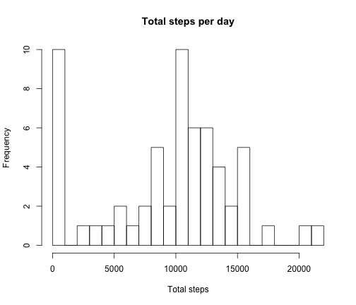
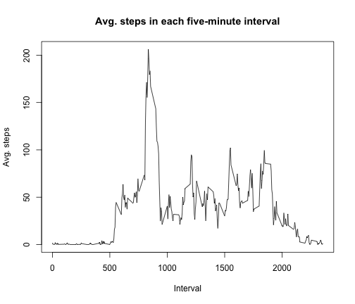
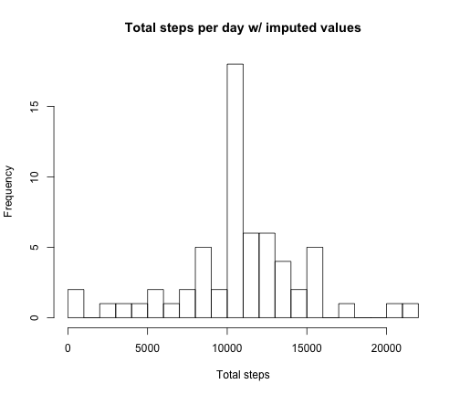
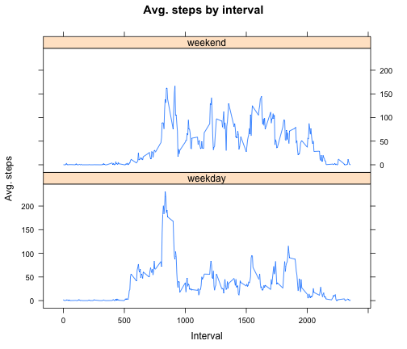

<br><center>**Course Project 1**</center>
<br> <br>
1.) Reading in dataset.


```r
library(plyr)
library(graphics)
library(lattice)
activity <- read.csv("activity.csv", stringsAsFactors = FALSE)
```

<br/>
2.) Histogram of the total number of steps taken each day.


```r
stepsPerDay <- aggregate(activity$steps, by=list(date=activity$date), sum, na.rm=TRUE)
hist(stepsPerDay$x, breaks=30, main = "Total steps per day", xlab = "Total steps")
```



<br/>
3.) Mean steps/day: 9354.23; median steps/day: 10395


```r
mean(stepsPerDay$x)
```

```
## [1] 9354.23
```

```r
median(stepsPerDay$x)
```

```
## [1] 10395
```

<br/>
4.) Time series plot of the average number of steps taken


```r
avgInterval <- aggregate(activity$steps, by=list(int=activity$interval), mean, na.rm=TRUE)
plot(avgInterval$int, avgInterval$x, type="l", main = "Avg. steps in each five-minute interval", xlab = "Interval", ylab = "Avg. steps")
```



<br/>
5.) The interval from 0835-0840, on average, contains the maximum number of steps.


```r
avgInterval$int[avgInterval$x == max(avgInterval$x)]
```

```
## [1] 835
```

<br/>
6.) Code to describe and show a strategy for imputing missing data

This code uses the mean number of steps for each interval (from avgInterval$x) as a basis for imputing missing values.


```r
sum(is.na(activity$steps))
```

```
## [1] 2304
```

```r
avgStpsByInt <- rep(avgInterval$x, 61)

newSteps <- c()
for (i in seq(length(activity$steps))) {
  if (is.na(activity$steps[i])) {
    newSteps <- append(newSteps, avgStpsByInt[i])
  } else {
    newSteps <- append(newSteps, activity$steps[i])
  }
}
newActivity <- data.frame(newSteps, date=activity$date, interval=activity$interval)
```

<br/>
7.) Histogram of the total number of steps taken each day after missing values are imputed


```r
newStepsPerDay <- aggregate(newSteps, by=list(date=activity$date), sum)
hist(newStepsPerDay$x, breaks = 30, main = "Total steps per day w/ imputed values", xlab = "Total steps")
```




```r
mean(newStepsPerDay$x)
```

```
## [1] 10766.19
```

```r
median(newStepsPerDay$x)
```

```
## [1] 10766.19
```
Mean: 10766.19
Median: 10766.19

Both values are higher than the original estimates. Imputing missing data seems to raise estimates and bring the mean and median closer together.


<br/>
8.) Panel plot comparing the average number of steps taken per 5-minute interval across weekdays and weekends


```r
days <- weekdays(as.Date(activity$date))
isWknd <- (days == "Saturday") | (days == "Sunday")
dayFactor <- factor(isWknd, labels = c("weekday", "weekend"))
newActivity$day.f <- dayFactor

avgStps <- aggregate(newActivity$newSteps, by = list(int = newActivity$interval, wknd = newActivity$day.f), FUN = mean)

p <- xyplot(avgStps$x ~ avgStps$int | avgStps$wknd, layout = c(1, 2), type = "l", main = "Avg. steps by interval", xlab = "Interval", ylab = "Avg. steps")
print(p)
```


